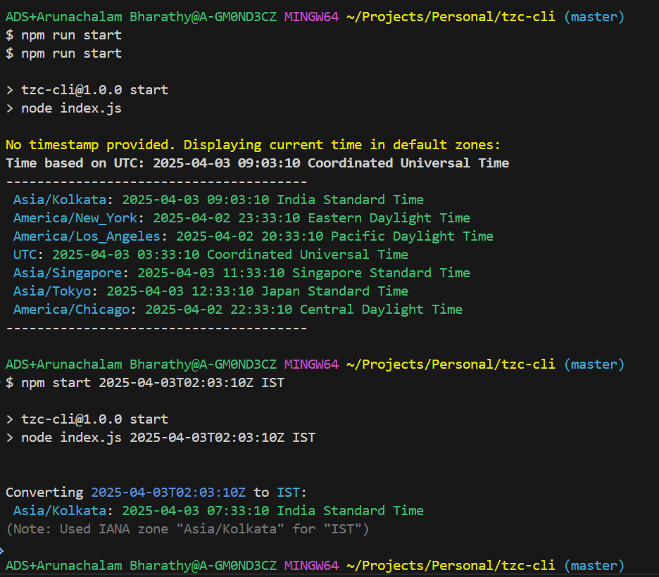

# tzc-cli

tzc-cli is a world clock application in a command line interface. Gives you a glimpse of the time in different time zones. 

## Demo


## Development setup

To run this project locally, follow these steps:
- Clone the repository:
```bash
git clone https://github.com/arunachalam-b/tzc-cli.git
cd tzc-cli
```
- Install dependencies:
```bash
npm install
```
- Start the development server:
```bash
npm start
```
